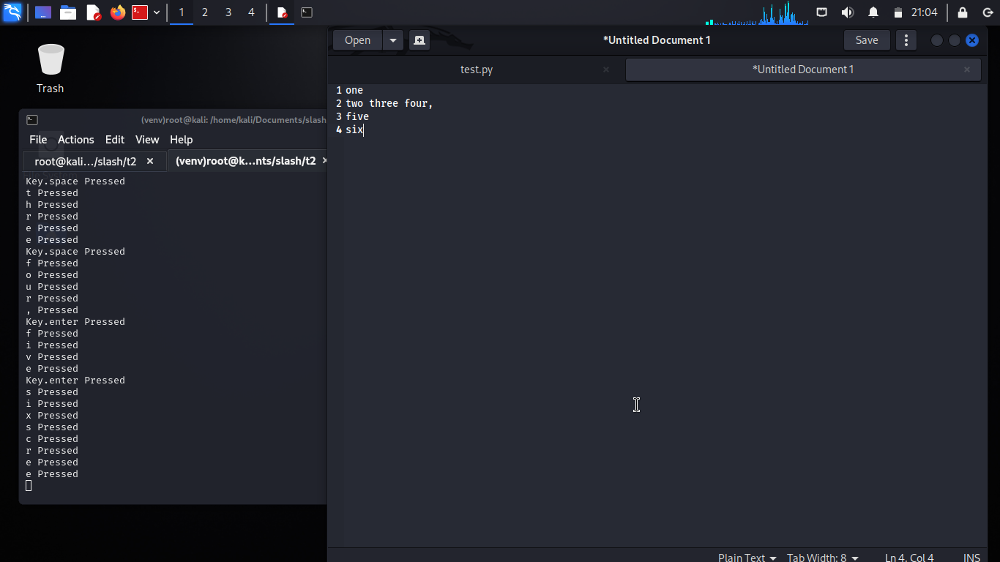

# Simple Keylogger
This simple keylogger is part of my internship program at SlashMark, designated as `Task-2`. The keylogger is designed to capture keyboard input and log it to a file.

## Overview
The keylogger is implemented in Python using the `pynput` library. It captures key presses and releases, writing the collected data to a file named `logs.txt`. The program also includes timestamping for each entry to provide a record of when the keystrokes occurred.

## Features
- Records key presses and releases.
- Writes data to `logs.txt` with timestamping.

## Getting Started
### Prerequisites
- Python 3.x
- pynput library (`pip install pynput`)

### Running the Keylogger
1. Clone the repository:
    ```bash
    git clone https://github.com/Patel-Aum-28/Simple-Keylogger.git
    cd simple-keylogger
    ```

2. Install the required dependencies:

    ```bash
    pip install pynput
    ```

3. Run the keylogger:
    ```bash
    python keylogger.py
    ```

## File Structure
- `keylogger.py`: The main Python script for the keylogger.
- `logs.txt`: The log file where keystrokes are recorded.

## Usage
- The keylogger will start capturing keystrokes once the program is executed.
- Press `Esc` to stop the keylogger.


## Example
### Process


### Output

